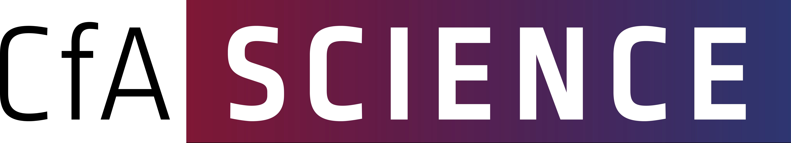
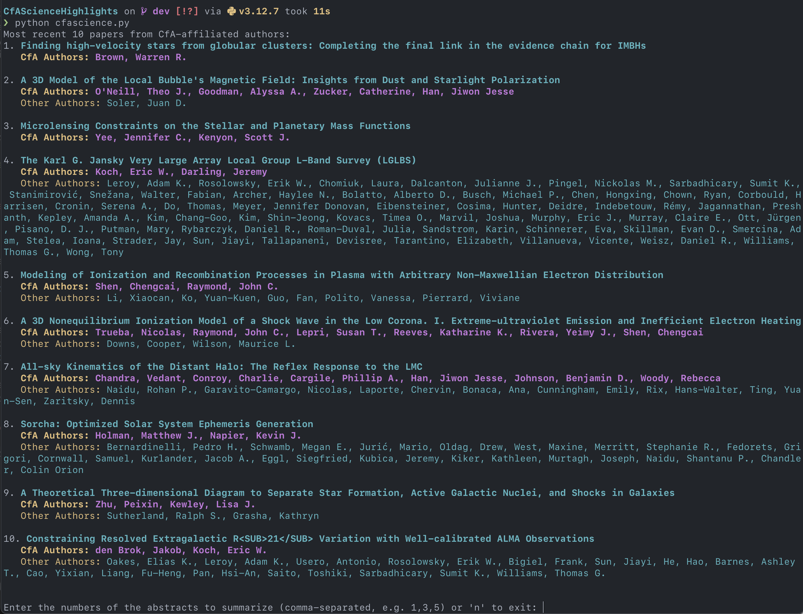
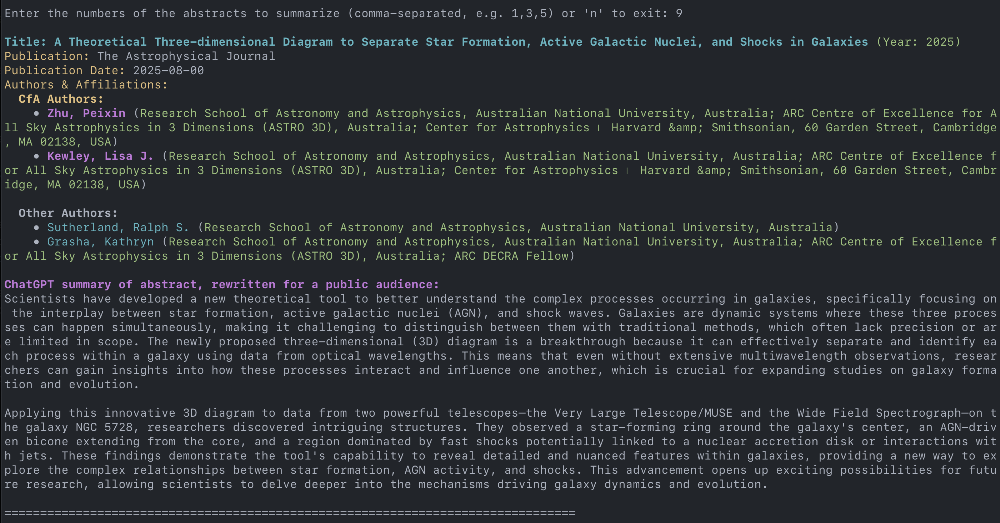

# CfA Science Highlights for the Public

A Python CLI tool that scrapes recent astronomical research papers from NASA ADS (Astrophysics Data System) and generates accessible, public-facing summaries using OpenAI's GPT-4. Designed specifically for CfA (Center for Astrophysics | Harvard & Smithsonian) staff to create newsletter content by transforming technical abstracts into engaging summaries for general audiences.

## Features

- **Smart Paper Discovery**: Automatically queries NASA ADS for recent papers (2025) with CfA/Smithsonian affiliations
- **Visual Author Highlighting**: CfA-affiliated authors are highlighted in magenta for easy identification
- **Interactive Selection**: Browse and select papers of interest through an intuitive terminal interface
- **AI-Powered Summaries**: Generate public-friendly summaries using OpenAI's GPT-4o model
- **Rich Terminal Output**: Clean, colorful formatting with ANSI colors for better readability
- **Testing Suite**: Comprehensive unit tests using pytest

## Important Notes

⚠️ **Use at your own risk** - Always manually vet AI-generated content before publication
📸 **Manual Figure Selection** - Remember to pick compelling figures from papers manually
✅ **Review Required** - Carefully review all generated summaries before using in newsletters

## Prerequisites

- Python 3.7+
- NASA ADS API token (free with ADS account)
- OpenAI API key (paid service)

## Installation

1. **Clone the repository**:
    ```bash
    git clone https://github.com/yourusername/CfAScienceHighlights.git
    cd CfAScienceHighlights
    ```

2. **Set up virtual environment** (recommended):
    ```bash
    python3 -m venv venv
    source venv/bin/activate  # On Windows: venv\Scripts\activate
    ```

3. **Install dependencies**:
    ```bash
    pip install -r requirements.txt
    ```

    **For Google Docs integration** (optional), also install:
    ```bash
    pip install -r requirements_google_docs.txt
    ```

4. Create a file called `api_keys.env` in the root directory of the project and add both a NASA ADS and OpenAI API key to it. The file contents should look like this:

    ```python
    NASA_ADS_API_KEY=your_nasa_ads_api_key
    OPENAI_API_KEY=your_openai_api_key
    ```

### Getting API Keys

- **NASA ADS API Token**: [Create free account and token](https://ui.adsabs.harvard.edu/help/api/)
- **OpenAI API Key**: [Get paid API access](https://platform.openai.com/api-keys) (~$10 covers extensive usage)

For assistance with OpenAI API keys, contact Grant Tremblay.


## Usage

To run the script, use the following command:
```bash
python cfascience.py
```

## Screenshots


After running `python cfascience.py`, the user should see something like this:



When the user then enters a comma-separated list of the abstracts to summarize (e.g. `3,4,8`), you will see something that looks like this:


The user may enter `n` should they not wish to see any summaries, and instead cleanly exit the script.

### Options (yet to come)

- I will add options to this code over time, but for now, a scrape from 2025 is hard-coded.